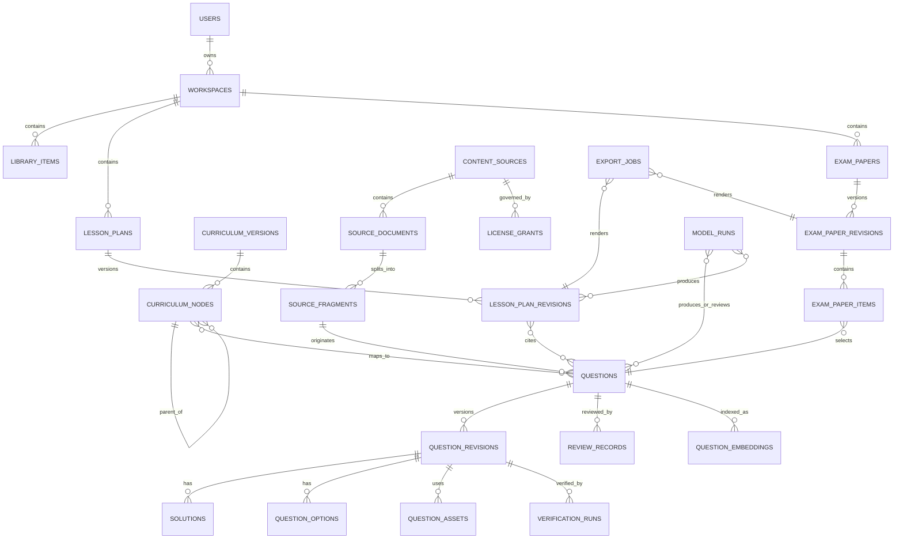

# 数据库 ERD v0.1

## 1. 设计原则

- PostgreSQL 为唯一事实来源。
- 题目正文、答案、解析和标签都采用版本记录，禁止无痕覆盖。
- 文件对象与结构化题目分离。
- 来源和权利记录独立存在，发布前由权利门禁计算可执行动作。
- 向量是可重建派生数据，不作为题目事实来源。
- 首版保留未来组织空间字段，但不实现复杂学校协作界面。

## 2. 核心 ERD

## 3. 关键表

### 用户与空间

- `users`：教师账户、管理员标志、地区和默认教材。
- `workspaces`：个人空间；未来可以扩展为学校空间。
- `workspace_memberships`：首版只有 owner，保留未来角色字段。
- `library_items`：收藏、私人上传和内容归属。

### 课程结构

- `curriculum_versions`：课程标准和教材目录版本。
- `curriculum_nodes`：册次、章节、节、课时、知识点。
- `curriculum_edges`：前置、相关、易混、教材到高考专题映射。
- `question_curriculum_mappings`：题目到知识点的多对多映射及置信度。

### 题目

- `questions`：稳定 ID、可见性、当前版本和生命周期状态。
- `question_revisions`：题干、题型和结构化内容的不可变版本。
- `question_options`：选择题选项。
- `solutions`：答案与独立解析版本。
- `question_assets`：自有重绘图形或私人文件引用。
- `question_embeddings`：搜索向量、模型和生成时间。
- `duplicate_clusters`：重复题和近似题簇。

### 来源与权利

- `content_sources`：来源主体和登记编号。
- `source_documents`：上传文件、校验哈希、存储位置和私人属性。
- `source_fragments`：页码、题号、坐标和抽取文本。
- `license_grants`：允许展示、改编、训练、导出等动作。
- `rights_decisions`：权利门禁的计算结果、依据和时间。
- `takedown_requests`：投诉、下架、处理和恢复记录。

### 审核与验证

- `verification_runs`：验证器、输入版本、结论、证据和风险。
- `review_records`：AI预检和教师确认记录。
- `publication_events`：发布、退回、下架和重新发布。

### 教案、试卷和导出

- `lesson_plans` / `lesson_plan_revisions`：教案及历史版本。
- `lesson_plan_blocks`：目标、流程、例题、板书、作业等内容块。
- `exam_papers` / `exam_paper_revisions`：试卷及历史版本。
- `exam_paper_items`：题目顺序、分值、分组和版本快照。
- `export_jobs`：DOCX/PDF任务、模板、状态和输出文件。

### AI 与计费

- `model_runs`：模型、提示版本、输入引用、输出、费用和错误。
- `prompt_versions`：提示词版本及评测结果。
- `usage_ledger`：额度增加、消耗、退款和人工调整。
- `subscriptions` / `orders` / `payments`：套餐与支付。

## 4. 必须坚持的不变量

1. 已发布内容不能直接更新，只能创建新版本并重新审核。
2. 私人文件派生题默认保持私人状态。
3. 每次模型输出都能追溯到模型、提示版本和引用内容。
4. 每次发布都必须存在有效权利决定和教师确认。
5. 试卷保存的是题目版本快照，题库后续修改不能悄悄改变历史试卷。
6. 删除源文件时，必须先计算题目、教案、试卷和导出物依赖。

## 5. 首版数据库实现顺序

1. 用户、空间和课程节点。
2. 来源、文件和权利。
3. 题目、版本、选项和解析。
4. 审核、验证和发布事件。
5. 搜索向量和重复题簇。
6. 教案、试卷和导出。
7. 模型运行、额度和订单。
